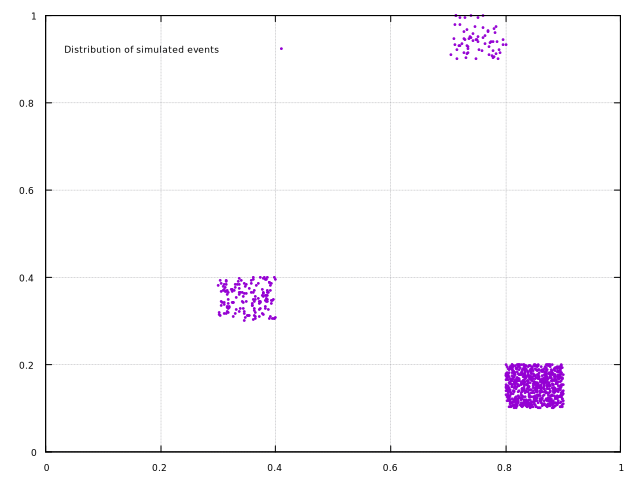

[](https://github.com/frithnanth/raku-Math-Libgsl-Histogram/actions)



NAME
====

Math::Libgsl::Histogram - An interface to libgsl, the Gnu Scientific Library - Histograms

SYNOPSIS
========

```raku
use Math::Libgsl::Histogram;

my $h = Math::Libgsl::Histogram.new(3).set-ranges(0, 10, 100, 1000);
say $h.find(18);
$h.scanf('file.dat');
say "max: { $h.max-val } in bin { $h.max-bin }";
say "mean: { $h.mean } standard deviation: { $h.sigma }";
```

```raku
use Math::Libgsl::Histogram2D;

my $h = Math::Libgsl::Histogram2D.new(10, 10)
        .set-uniform(0, 1, 0, 1)
        .accumulate(.3, .3, 1)
        .accumulate(.8, .1, 5)
        .accumulate(.7, .9, .5);
say "Number of bins: x = { $h.nx }, y = { $h.ny }"; # output: Number of bins: x = 10, y = 10
say "bin (0, 0) = { $h.get(0, 0) }";                # output: bin (7, 9) = 0.5
```

DESCRIPTION
===========

Math::Libgsl::Histogram is an interface to the Histogram functions of libgsl, the Gnu Scientific Library.

This module exports four classes:

  * Math::Libgsl::Histogram

  * Math::Libgsl::Histogram::PDF

  * Math::Libgsl::Histogram2D

  * Math::Libgsl::Histogram2D::PDF

Histogram manages one-dimensional histograms, Histogram2D manages two-dimensional histograms, Histogram::PDF uses the 1D histogram as a probability function, same goes for the Histogram2D::PDF.

Math::Libgsl::Histogram
-----------------------

### new(UInt $size!)

### new(UInt :$size!)

The constructor accepts one simple or named argument: the histogram size, or number of bins.

### set-ranges(*@ranges where *.elems == self.bins + 1 --> Math::Libgsl::Histogram)

This method sets the ranges of the histogram using the **@array**.

This method returns **self**, to allow method chaining.

### set-uniform(Num() $xmin, Num() $xmax where * > $xmin --> Math::Libgsl::Histogram)

This method sets the ranges of the histogram to cover the range from **$xmin** to **$xmax** uniformly.

This method returns **self**, to allow method chaining.

### increment(*@x --> Math::Libgsl::Histogram)

This method updates the histogram by adding one (1.0) to each bin whose range contains each of the coordinates **@x**.

This method returns **self**, to allow method chaining.

### accumulate(Num() $x, Num() $weight --> Math::Libgsl::Histogram)

This method updates the histogram by increasing the value of the appropriate bin by the floating-point number **$weight**.

This method returns **self**, to allow method chaining.

### get(Int $i where * < self.bins --> Num)

This method returns the content of the i-th bin of the histogram.

### get-range(UInt $i --> List)

This method finds the upper and lower range limits of the i-th bin of the histogram and returns them as a two-value list.

### max(--> Num)

### min(--> Num)

### bins(--> UInt)

These methods return the maximum upper and minimum lower range limits and the number of bins of the histogram.

### reset()

This method resets all the bins in the histogram to zero.

### find(Num() $x --> UInt)

This method returns the index of the bin which covers the coordinate **$x** in the histogram.

### copy(Math::Libgsl::Histogram $src where { $src.bins == self.bins } --> Math::Libgsl::Histogram)

This method copies the histogram **$src** into the current object.

This method returns **self**, to allow method chaining.

### clone(--> Math::Libgsl::Histogram)

This method returns a newly created histogram which is an exact copy of the current histogram.

### max-val(--> Num)

This method returns the maximum value contained in the histogram bins.

### max-bin(--> UInt)

This method returns the index of the bin containing the maximum value.

### min-val(--> Num)

This method returns the minimum value contained in the histogram bins.

### min-bin(--> UInt)

This method returns the index of the bin containing the minimum value.

### mean(--> Num)

This method returns the mean of the histogrammed variable, where the histogram is regarded as a probability distribution.

### sigma(--> Num)

This method returns the standard deviation of the histogrammed variable, where the histogram is regarded as a probability distribution.

### sum(--> Num)

This method returns the sum of all bin values.

### equal(Math::Libgsl::Histogram $h2 --> Bool)

This method returns True if the all of the individual bin ranges of the two histograms are identical, and False otherwise.

### add(Math::Libgsl::Histogram $h2 --> Math::Libgsl::Histogram)

This method adds the contents of the bins in histogram h2 to the corresponding bins of the current histogram.

The two histograms must have the same number of bins and the same ranges.

This method returns **self**, to allow method chaining.

### sub(Math::Libgsl::Histogram $h2 --> Math::Libgsl::Histogram)

This method subtracts the contents of the bins in histogram h2 from the corresponding bins of the current histogram.

The two histograms must have the same number of bins and the same ranges.

This method returns **self**, to allow method chaining.

### mul(Math::Libgsl::Histogram $h2 --> Math::Libgsl::Histogram)

This method multiplies the contents of the bins in histogram h2 by the corresponding bins of the current histogram.

The two histograms must have the same number of bins and the same ranges.

This method returns **self**, to allow method chaining.

### div(Math::Libgsl::Histogram $h2 --> Math::Libgsl::Histogram)

This method divides the contents of the bins in histogram h2 by the corresponding bins of the current histogram.

The two histograms must have the same number of bins and the same ranges.

This method returns **self**, to allow method chaining.

### scale(Num() $scale --> Math::Libgsl::Histogram)

This method multiplies the contents of the bins of the current histogram by **$scale**.

This method returns **self**, to allow method chaining.

### shift(Num() $offset --> Math::Libgsl::Histogram)

This method shifts the contents of the bins of the current histogram by **$offset**.

This method returns **self**, to allow method chaining.

### write(Str $filename --> Math::Libgsl::Histogram)

This method writes the ranges and bins of the current histogram to a file in binary format.

This method returns **self**, to allow method chaining.

### read(Str $filename --> Math::Libgsl::Histogram)

This method reads the ranges and bins of the current histogram from a file in binary format.

This method returns **self**, to allow method chaining.

### printf(Str $filename, Str $range-format, Str $bin-format --> Math::Libgsl::Histogram)

This function writes the ranges and bins of the current histogram line-by-line to a file using the format specifiers **$range-format** and **$bin-format**.

This method returns **self**, to allow method chaining.

### scanf(Str $filename --> Math::Libgsl::Histogram)

This function reads formatted data from a file.

The histogram must be preallocated with the correct length since the C library function uses the size of the current object to determine how many numbers to read.

This method returns **self**, to allow method chaining.

Math::Libgsl::Histogram::PDF
----------------------------

### new(UInt $size!, Math::Libgsl::Histogram $h!)

### new(UInt :$size!, Math::Libgsl::Histogram :$h!)

The constructor accepts two simple or named arguments: the probability distribution function size, or number of bins, and the histogram.

The histogram must not contain negative values, because a probability distribution cannot contain negative values.

### sample(Num() $r --> Num)

This method uses **$r**, a uniform random number between zero and one, to compute a single random sample from the probability distribution object.

Math::Libgsl::Histogram2D
-------------------------

### new(UInt $nx!, UInt $ny!)

### new(UInt :$nx!, UInt :$ny!)

The constructor accepts two simple or named arguments: the number of bins in the x direction **$nx** and the number of bins in the y direction **$ny**.

### set-ranges(:@xranges where *.elems == self.nx + 1, :@yranges where *.elems == self.ny + 1 --> Math::Libgsl::Histogram2D)

This method sets the ranges of the current histogram using the arrays **@xrange** and **@yrange**.

This method returns **self**, to allow method chaining.

### set-uniform(Num() $xmin, Num() $xmax where * > $xmin, Num() $ymin, Num() $ymax where * > $ymin --> Math::Libgsl::Histogram2D)

This method sets the ranges of the histogram to cover the ranges **$xmin** to **$xmax** and **$ymin** to **$ymax** uniformly.

This method returns **self**, to allow method chaining.

### increment(Num() $x, Num() $y --> Math::Libgsl::Histogram2D)

This method updates the histogram by adding one (1.0) to the bin whose x and y ranges contain the coordinates **($x, $y)**.

This method returns **self**, to allow method chaining.

### accumulate(Num() $x, Num() $y, Num() $weight --> Math::Libgsl::Histogram2D)

This method updates the histogram by increasing the value of the appropriate bin by the floating-point number **$weight**.

This method returns **self**, to allow method chaining.

### get(UInt $i where * < self.nx, Int $j where * < self.ny --> Num)

This method returns the content of the (i, j)-th bin of the histogram.

### get-xrange(UInt $i --> List)

### get-yrange(UInt $i --> List)

This method finds the upper and lower range limits of the i-th and j-th bin in the x and y directions of the histogram and returns them as a two-value list.

### xmax(--> Num)

### xmin(--> Num)

### nx(--> UInt)

### ymax(--> Num)

### ymin(--> Num)

### ny(--> UInt)

These methods return the maximum upper and minimum lower range limits and the number of bins of the histogram.

### reset()

This method resets all the bins in the histogram to zero.

### find(Num() $x, Num() $y --> List)

This method returns the index of the bin which covers the coordinate **($x, $y)** in the histogram.

### copy(Math::Libgsl::Histogram2D $src where { $src.nx == self.nx && $src.ny == self.ny } --> Math::Libgsl::Histogram2D)

This method copies the histogram **$src** into the current object.

This method returns **self**, to allow method chaining.

### clone(--> Math::Libgsl::Histogram2D)

This method returns a newly created histogram which is an exact copy of the current histogram.

### max-val(--> Num)

This method returns the maximum value contained in the histogram bins.

### max-bin(--> List)

This method returns the indexes of the bin containing the maximum value.

### min-val(--> Num)

This method returns the minimum value contained in the histogram bins.

### min-bin(--> List)

This method returns the indexes of the bin containing the minimum value.

### xmean(--> Num)

This method returns the mean of the histogrammed x variable, where the histogram is regarded as a probability distribution.

### ymean(--> Num)

This method returns the mean of the histogrammed y variable, where the histogram is regarded as a probability distribution.

### xsigma(--> Num)

This method returns the standard deviation of the histogrammed x variable, where the histogram is regarded as a probability distribution.

### ysigma(--> Num)

This method returns the standard deviation of the histogrammed y variable, where the histogram is regarded as a probability distribution.

### cov(--> Num)

This method returns the covariance of the histogrammed x and y variables, where the histogram is regarded as a probability distribution.

### sum(--> Num)

This method returns the sum of all bin values.

### equal(Math::Libgsl::Histogram2D $h2 --> Bool)

This method returns True if the all of the individual bin ranges of the two histograms are identical, and False otherwise.

### add(Math::Libgsl::Histogram2D $h2 --> Math::Libgsl::Histogram2D)

This method adds the contents of the bins in histogram h2 to the corresponding bins of the current histogram.

The two histograms must have the same number of bins and the same ranges.

This method returns **self**, to allow method chaining.

### sub(Math::Libgsl::Histogram2D $h2 --> Math::Libgsl::Histogram2D)

This method subtracts the contents of the bins in histogram h2 from the corresponding bins of the current histogram.

The two histograms must have the same number of bins and the same ranges.

This method returns **self**, to allow method chaining.

### mul(Math::Libgsl::Histogram2D $h2 --> Math::Libgsl::Histogram2D)

This method multiplies the contents of the bins in histogram h2 by the corresponding bins of the current histogram.

The two histograms must have the same number of bins and the same ranges.

This method returns **self**, to allow method chaining.

### div(Math::Libgsl::Histogram2D $h2 --> Math::Libgsl::Histogram2D)

This method divides the contents of the bins in histogram h2 by the corresponding bins of the current histogram.

The two histograms must have the same number of bins and the same ranges.

This method returns **self**, to allow method chaining.

### scale(Num() $scale --> Math::Libgsl::Histogram2D)

This method multiplies the contents of the bins of the current histogram by **$scale**.

This method returns **self**, to allow method chaining.

### shift(Num() $offset --> Math::Libgsl::Histogram2D)

This method shifts the contents of the bins of the current histogram by **$offset**.

This method returns **self**, to allow method chaining.

### write(Str $filename --> Math::Libgsl::Histogram2D)

This method writes the ranges and bins of the current histogram to a file in binary format.

This method returns **self**, to allow method chaining.

### read(Str $filename --> Math::Libgsl::Histogram2D)

This method reads the ranges and bins of the current histogram from a file in binary format.

This method returns **self**, to allow method chaining.

### printf(Str $filename, Str $range-format, Str $bin-format --> Math::Libgsl::Histogram2D)

This function writes the ranges and bins of the current histogram line-by-line to a file using the format specifiers **$range-format** and **$bin-format**.

This method returns **self**, to allow method chaining.

### scanf(Str $filename --> Math::Libgsl::Histogram2D)

This function reads formatted data from a file.

The histogram must be preallocated with the correct length since the C library function uses the size of the current object to determine how many numbers to read.

This method returns **self**, to allow method chaining.

Math::Libgsl::Histogram2D::PDF
------------------------------

### new(UInt $nx!, UInt $ny!, Math::Libgsl::Histogram2D $h!)

### new(UInt :$nx!, UInt :$ny!, Math::Libgsl::Histogram2D :$h!)

The constructor accepts three simple or named arguments: the probability distribution function x and y number of bins, and the histogram.

The histogram must not contain negative values, because a probability distribution cannot contain negative values.

### sample(Num() $r1, Num() $r2 --> List)

This method uses two uniform random numbers between zero and one, **$r1** and **$r2**, to compute a single random sample from the two-dimensional probability distribution.

C Library Documentation
=======================

For more details on libgsl see [https://www.gnu.org/software/gsl/](https://www.gnu.org/software/gsl/).

The excellent C Library manual is available here [https://www.gnu.org/software/gsl/doc/html/index.html](https://www.gnu.org/software/gsl/doc/html/index.html), or here [https://www.gnu.org/software/gsl/doc/latex/gsl-ref.pdf](https://www.gnu.org/software/gsl/doc/latex/gsl-ref.pdf) in PDF format.

Prerequisites
=============

This module requires the libgsl library to be installed. Please follow the instructions below based on your platform:

Debian Linux and Ubuntu 20.04
-----------------------------

    sudo apt install libgsl23 libgsl-dev libgslcblas0

That command will install libgslcblas0 as well, since it's used by the GSL.

Ubuntu 18.04
------------

libgsl23 and libgslcblas0 have a missing symbol on Ubuntu 18.04.

I solved the issue installing the Debian Buster version of those three libraries:

  * [http://http.us.debian.org/debian/pool/main/g/gsl/libgslcblas0_2.5+dfsg-6_amd64.deb](http://http.us.debian.org/debian/pool/main/g/gsl/libgslcblas0_2.5+dfsg-6_amd64.deb)

  * [http://http.us.debian.org/debian/pool/main/g/gsl/libgsl23_2.5+dfsg-6_amd64.deb](http://http.us.debian.org/debian/pool/main/g/gsl/libgsl23_2.5+dfsg-6_amd64.deb)

  * [http://http.us.debian.org/debian/pool/main/g/gsl/libgsl-dev_2.5+dfsg-6_amd64.deb](http://http.us.debian.org/debian/pool/main/g/gsl/libgsl-dev_2.5+dfsg-6_amd64.deb)

Installation
============

To install it using zef (a module management tool):

    $ zef install Math::Libgsl::Histogram

AUTHOR
======

Fernando Santagata <nando.santagata@gmail.com>

COPYRIGHT AND LICENSE
=====================

Copyright 2020 Fernando Santagata

This library is free software; you can redistribute it and/or modify it under the Artistic License 2.0.

